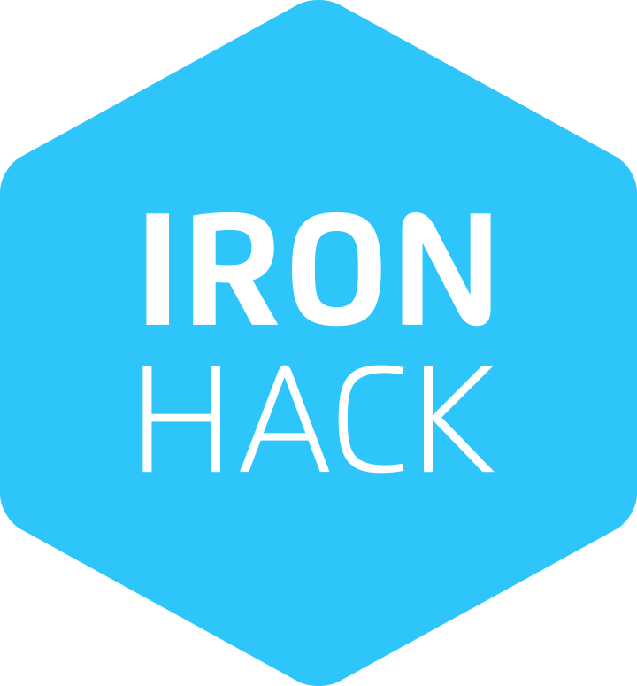
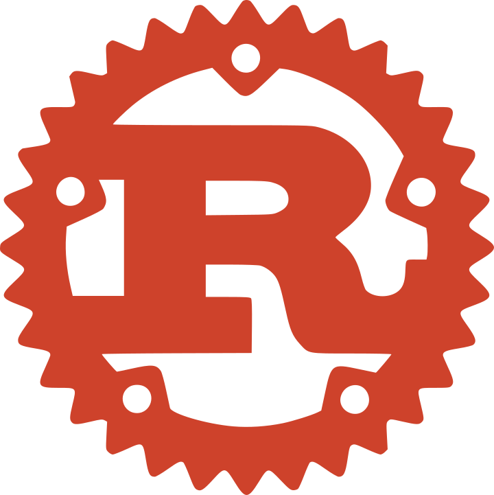
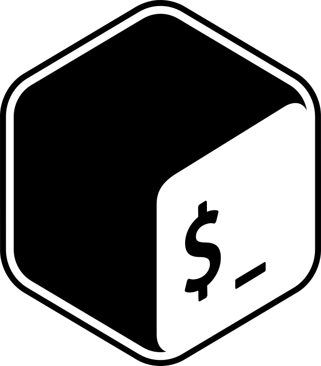
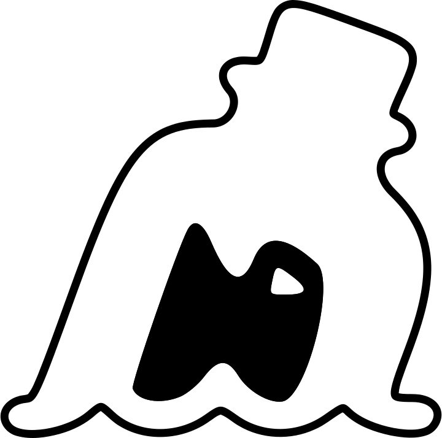

<h2 align="center">Hi There 👋</h2>

<section align="center">
  
  
</section>

**I'm..**

A full stack developer based in Paris. I have a degree in architecture; And varying degrees of experience in different other fields.

**I enjoy..**

Learning new things; Reading; Swimming; Boxing; And watching movies.

**I'm currently doing IronHack**

---

## Technologies
<section align="center">
<h3>On my toolbelt</h3>
  
  
  
  
  
  
  
  
  
  
</section>

<section align="center">
<h3>On my wishlist</h3>
  
  
  
  
  
  
</section>

---

## Projects

###  <a href="https://github.com/haroun-b/iframe-resizer">iframe Resizer - Browser Extension</a>
###  <a href="https://github.com/haroun-b/pacman-on-the-grid">PacMan - On the Grid</a>
###  <a href="https://github.com/haroun-b/bottle-me-maybe">Bottle Me Maybe - REST API</a>